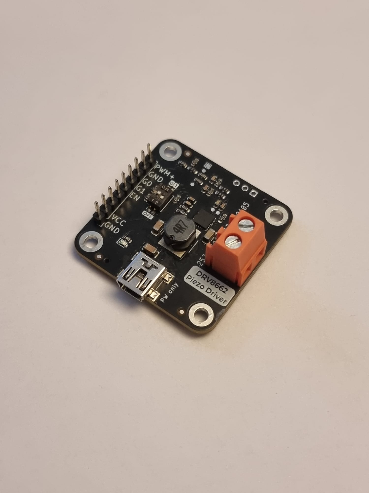
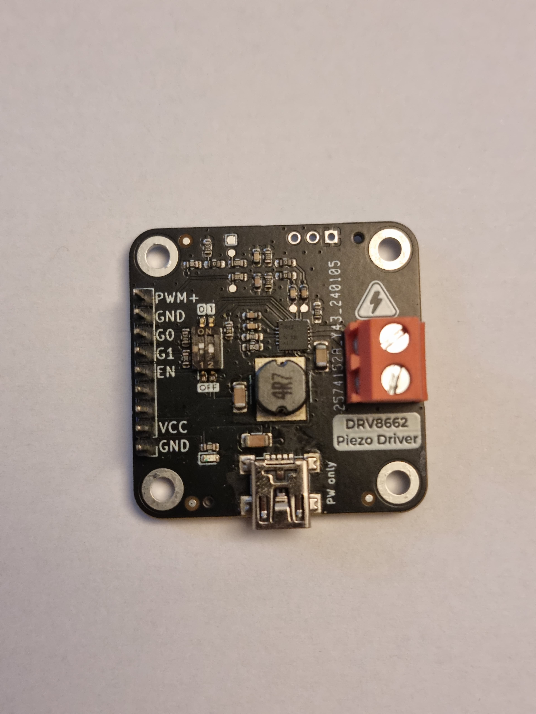

# DRV8662-breakout

  
&nbsp; &nbsp; &nbsp; &nbsp;
  
&nbsp; &nbsp; &nbsp; &nbsp;
  

### What is it?
This is a ready-to-go development board with everything necessary to run piezo actuators.
It features a DRV8662 IC from Texas Instruments and all the additional circuitry for it to work as expected.

### How does it function?
The IC serves multiple purposes. First of all it is a boost-converter to generate up 200V from the 3.3-5V it takes as an input. Secondly it features an amplifier which takes a PWM Signal and drives the Output pins to the respective differential values according to the input.

At the output you can connect a piezo actuator for haptic feedback or valves & pumps.
The output voltage is an AC Waveform with an adjustable Peak-to-Peak voltage.

### What is special about it?
The Output voltage can be to 4 approximate value: 50Vpp, 100Vpp, 150Vpp, 200Vpp using a simple dip switch.

### How do I get started?
All you need to do is connect an PWM and GND pin of a microcontroller to the PWM+ Pin and GND pin of the development board respectively. This covers the “signal” part.
To power the dev board you can either use the USB mini jack (we recommend using a USB hub for this) or through the included VCC and GND Pins. 
Be sure to stick to an input voltage of 3.3V to 5V and be aware that the USB voltage will be present on the VCC pin.
